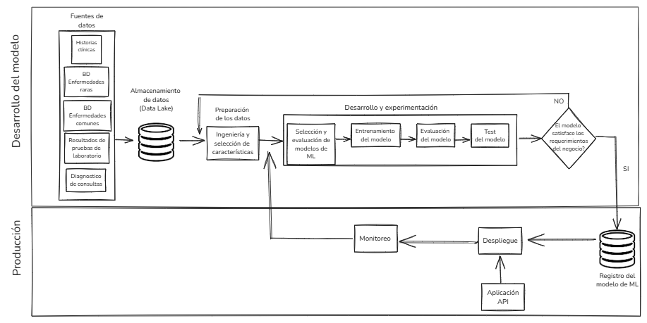

# Taller de MLOP's
Repositorio para entregar las actividades de la materia Machine Learning Operations(MLOps) de la Maestria en IA - Icesi

# Descripción del problema
Dados los avances tecnológicos, en el campo de la medicina la cantidad de información que existe de los pacientes es muy abundante. Sin embargo, para algunas enfermedades no tan comunes, llamadas huérfanas, los datos que existen escasean. Se requiere construir un modelo que sea capaz de predecir, dados los datos de síntomas de un paciente, si es posible o no que este sufra de alguna enfermedad. Esto se requiere tanto para enfermedades comunes (muchos datos) como para enfermedades huérfanas (pocos datos)

# Diseño de Pipeline de ML
El siguiente modelo de pipeline de ML pretende dar solución a los requerimientos planteados en la descripción del problema anterior. 

# Fuente de datos
Para solventar esta problemática, tenemos como input de datos las historias clínicas de cada paciente, adicionalmente esperamos contar con el resultado de las pruebas de laboratorio, los examenes previamente realizados a igual que cualquier diagnóstico médico que se le haya realizado al paciente y que no esté en su historia clínica. Por otro lado, esperamos tener acceso a bases de datos especializadas donde se encuentren diagnósticos de enfermedades raras al igual que enfermedades comunes que nos ayuden a poder clasificar los pacientes según sus síntomas.
Como base de datos de enfermedades raras se deberia tener acceso a base de datos como Orphanet o OMIM.

# Almacenamiento de datos
Debido los diversos formatos que se podrian tener como datos estructurados y no estructurados, lo mas recomendable es almacenar esta información en un data lake.

# Preparación de los datos
En la etapa de preparación de datos esperamos hacer ingenieria de caractaristicas (featuring engineering) y selección de caracteriticas (ffeature selection) usando algoritmos tradicicionales para esta tarea como PCA y LDA (análisis de discriminante lineal).

# Selección y evaluación de modelos de ML
Para encontar la mejor solución para el problema planteado, se propone utilizar algoritmos como Regresión logistica multiple, Random Forest, XGBoost, redes neuronales (MLP y Transformers) y ensambles como máquinas de soporte vectorial y GBM.

# Entrenamiento, evaluación y pruebas del modelo
En esta parte de pipeline dividimos de forma aleatoria los datos de entrada en 3 partes para realizar entrenamiento, evaluación y pruebas, generalmente la división de datos se realiza en porcentaje de 70%, 20% y 10% respectivamente.
Para medir el desempeño de los modelos seleccionados se realizará una comparación en métricas como el accuracy, recall, F1-score y el MSE (Error Cuadrático Medio).

# Evaluación de requirimientos del negocio
En esta parte del pipeline evaluaremos si el modelo de Machine Learning seleccionado satisface las necesidades del negocio, si la clasificación de la gravedad de las enfermedades satisface los requerimientos de los interesados en el modelo de clasificación; si se concluye que el modelo no satisface las necesidades del negocio nos devolveremos hasta la fase de preparación de los datos y evolución de características y volveremos a iniciar el proceso.
Por otro lado, de ser satisfactoria la solución brindada por el modelo de ML, seguiremos adelante con el pipeline.

# Registro del Modelo de ML
Se realiza en el registro del modelo de ML para su posterior versionamineto, administración y seguimiento.
Este registro se podria realizar en herramientas como MLflow, Snowflake, Azure ML, Amazon SageMaker, GitLab o alguna otra herramienta que permira el registro del modelo de ML.

# Despliegue en producción
Una vez el modelo de Machine Learning este entrenado, evaluado y validado, ya se encuentra listo para ser desplegado en producción. Para esta tarea generalmente se usa uno o varios contenedores Docker y opcionalmente se puede utilizar Kubernetes en caso de tener varios contenedores Docker.
Algunos de los servicios de infraetructura mas usados en la nube utilizados para desplegar modelos de ML en producción son : Amazon web Services, Microsotf Azure y Google Cloud Platform.

Otra forma de desplegar este modelo de ML es exponiendo una API Rest para enviar datos al modelo y asi poder obtener la predicción de la posible enfermedad del paciente.

# Monitoreo
Esta tarea se realiza una vez la modelo esta desplegado en producción y el objetivo de esta es poder monitorear si el desempeño del modelo de ML sigue cumpliendo con las expectativas de los interesados o del negocio.
El desempeño del ML se puede degradar principalmente por cambios en los datos de entrada al mismo, o por cambios en los requerimientos por parte de los interesados o en algunos casos por la actualización de dependencias de alguno de los componentes del modelo.

