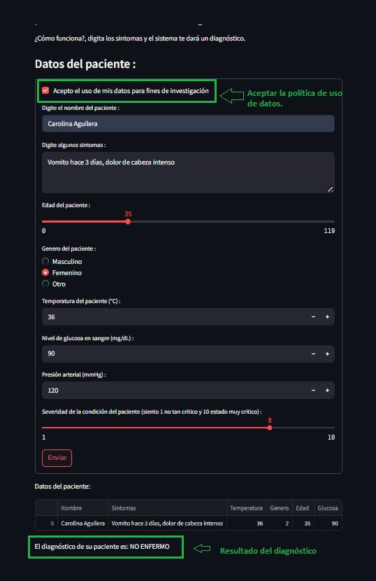

# Objetivo de este Repositorio Git ---> v1.0.0

Repositorio para entregar las actividades de la materia Machine Learning Operations(MLOps) de la Maestria en IA - Universidad Icesi.

# Descripción del Problema
Dados los avances tecnológicos, en el campo de la medicina la cantidad de información que existe de los pacientes es muy abundante. Sin embargo, para algunas enfermedades no tan comunes, llamadas huérfanas, los datos que existen escasean. Se requiere construir un modelo que sea capaz de predecir, dados los datos de síntomas de un paciente, si es posible o no que este sufra de alguna enfermedad.  
Esto se requiere tanto para enfermedades comunes (muchos datos) como para enfermedades huérfanas (pocos datos).

# Diseño de Pipeline de ML
El siguiente modelo de pipeline de ML pretende dar solución a los requerimientos planteados en la descripción del problema anterior; el pipeline propuesto consiste en desplegar en producción un modelo de Machine Learning, que, según los datos de entrada, que en este caso serán datos relacionados con la salud y los síntomas de cada paciente, el modelo sea capaz de predecir el diagnostico de alguna de las siguientes categorías de enfermedades:  

 - NO ENFERMO
 - ENFERMEDAD LEVE
 - ENFERMEDAD AGUDA
 - ENFERMEDAD CRÓNICA
 - ENFERMEDAD TERMINAL

# Fuente de Datos
Para solventar esta problemática, tenemos como input de datos las historias clínicas de cada paciente, adicionalmente esperamos contar con el resultado de las pruebas de laboratorio, los examenes previamente realizados a igual que cualquier diagnóstico médico que se le haya realizado al paciente y que no esté en su historia clínica.  
Por otro lado, esperamos tener acceso a bases de datos especializadas donde se encuentren diagnósticos de enfermedades raras al igual que enfermedades comunes que nos ayuden a poder clasificar los pacientes según sus síntomas.  
Como base de datos de enfermedades raras, esperamos tener acceso a base de datos como [***Orphanet***](https://www.orpha.net/es) y [***OMIM***](https://www.omim.org/).

# Almacenamiento de Datos
Debido los diversos formatos que se podrían tener como datos estructurados y no estructurados, lo más recomendable es almacenar esta información en un data lake.  
Para este propósito, necesitamos tener el servicio de almacenamiento [***Amazon S3***](https://aws.amazon.com/es/s3/).

# Preparación de los Datos
En la etapa de preparación de datos esperamos hacer ingeniería de características (featuring engineering) y selección de características (feature selection) usando algoritmos tradicionales para esta tarea como PCA y LDA (análisis de discriminante lineal).  
Para realizar esta tarea de preparación de datos, es crucial el uso de algún editor de Python como [***Google Colab***](https://colab.google/) o [***Jupyter***](https://jupyter.org/), junto con el uso de librerias para manipulación de datos almacenados, y aquí generalmente suelen utilizarse librerias como: [***Pandas***](https://pandas.pydata.org/), [***Numpy***](https://numpy.org/), [***Matplotlib***](https://matplotlib.org/stable/) y [***Seaborn***](https://seaborn.pydata.org/index.html), entre otras.

 Para balancear los datos principalmente por las enfermedades huérfanas, podemos usar técnicas como:
 - Oversampling: SMOTE o ADASYN para enfermedades huérfanas.
 - Undersampling: Si los datos comunes son abundantes.
 - Pesos en el modelo: Asignar mayor peso a la clase minoritaria.

# Selección y Evaluación de Modelos de ML
Para encontrar la mejor solución para el problema planteado, se propone utilizar algoritmos como Regresión logística múltiple, Random Forest, XGBoost, redes neuronales (MLP o Transformers) y ensambles como máquinas de soporte vectorial y GBM.
En esta fase del pipeline, nos apoyaremos principalmente en la libreria de Python [***sklearn***](https://scikit-learn.org/stable/).

# Entrenamiento, Evaluación y Pruebas del Modelo
En esta fase del pipeline dividiremos de forma aleatoria los datos de entrada en 3 partes para realizar entrenamiento, evaluación y pruebas, generalmente la división de datos se realiza en porcentaje de 70%, 20% y 10% respectivamente.  
Para esta fase usaremos principalmente los modelos de ML y regresión lineal contenidos en la librería de Python [***sklearn***](https://scikit-learn.org/stable/) y esto junto con el servicio de [***Amazon SageMaker***](https://aws.amazon.com/es/sagemaker/) nos va a permitir encontrar el mejor modelo para diagnosticar el tipo de enfermedad según los datos del paciente.

Para medir el desempeño de los modelos seleccionados se realizará una comparación en métricas como :
 - Accuracy (Presión): Proporción de predicciones correctas sobre el total.
 - Recall (Sensibilidad): Proporción de casos positivos reales detectados.
 - F1-score: Media armónica entre precisión y recall. Ideal para equilibrar ambas métricas.
 - MSE (Error Cuadrático Medio): Estimador mide el promedio de los errores al cuadrado.

 Para clases desbalanceadas debido principalmente a las enfermedades raras se podria utilizar:
 - Recall por clase (Sensibilidad por enfermedad): Asegurar que las enfermedades raras no se pasen por alto.
 - Precisión por clase: Evitar sobrediagnóstico de enfermedades raras.
 - Average Precision (AP): Versión ponderada del recall, útil para desbalance.

# Evaluación de Requerimientos del Negocio
En esta parte del pipeline evaluaremos si el modelo de Machine Learning seleccionado satisface las necesidades del negocio, si la clasificación de la gravedad de las enfermedades satisface los requerimientos de los interesados en el modelo de clasificación; si se concluye que el modelo no satisface las necesidades del negocio nos devolveremos hasta la fase de preparación de los datos y evaluación de características y volveremos a iniciar el proceso.  
Por otro lado, de ser satisfactoria la solución brindada por el modelo de ML, seguiremos adelante con el pipeline.  
En este punto del pipeline es crucial poder contar con métricas especificas sobre los resultados de las pruebas y su ***matriz de confusión*** para poder validar si el modelo está prediciendo o no de forma adecuada los diagnosticos de las enfermedades.

# Registro del Modelo de ML
Se realiza en el registro del modelo de ML para su posterior versionamiento, administración y seguimiento.  
La herramienta que vamos a usar en este pipeline es [***Amazon SageMaker***](https://aws.amazon.com/es/sagemaker/).

# Despliegue en Producción
Una vez el modelo de Machine Learning este entrenado, evaluado y validado, ya se encuentra listo para ser desplegado en producción. Para esta tarea generalmente se usa uno o varios contenedores [***Docker***](https://www.docker.com/) y opcionalmente se puede utilizar [***kubernetes***](https://kubernetes.io/) en caso de tener varios contenedores.  
Algunos de los servicios de infraetructura pagos más usados en la nube utilizados para desplegar modelos de ML en producción son: Amazon web Services, Microsotf Azure y Google Cloud Platform.    
Para el despliegue de este modelo en producción vamos a usar un servicio llamado [***RailWay***](https://railway.com/), que a su vez permite usar contenedores [***Docker***](https://www.docker.com/) junto con orquestadores de contenedores [***kubernetes***](https://kubernetes.io/).

# Aplicación API (*FrontEnd y BackEnd*)
La forma de exponer el modelo de ML a los médicos para que puedan realizar el diagnóstico de las enfermedades según los síntomas, será exponiendo una API Rest para enviar datos al modelo y asi poder obtener la predicción de la posible enfermedad del paciente.  
El frontend de la aplicación se construirá en la herramienta [***Streamlit***](https://streamlit.io/) y para el backend, se creará un API Rest usando Python y [***FastAPI***](https://fastapi.tiangolo.com/).

# Monitoreo
Esta tarea se realiza una vez la modelo esta desplegado en producción y el objetivo de esta es poder monitorear si el desempeño del modelo de ML sigue cumpliendo con las expectativas de los interesados o del negocio.  
El desempeño del ML se puede degradar principalmente por cambios en los datos de entrada al mismo, o por cambios en los requerimientos por parte de los interesados o en algunos casos por la actualización de dependencias de alguno de los componentes del modelo.  
Para llevar a cabo esta fase del pipeline, nos apoyaremos en herramientas de visualización y análisis de datos como [***Power BI***](https://www.microsoft.com/es-es/power-platform/products/power-bi) y [***WHYLABS***](https://whylabs.ai/) que es una herramienta que nos permite resolver problemas como la desviación del rendimiento de modelos de IA. 

# Feedback y Reentrenamiento
Esta tarea de retroalimentación y mejora continua, consiste en realizar validación de los resultados de la etapa inmediatamente anterior (Monitoreo) para constatar que el modelo desplegado aún es consistente con las métricas esperadas por los médicos que usan la aplicación de diagnostico y en caso de que los resultados no esten dentro de los valores esperados, se debe reentrenar el modelo para que se ajuste a las nuevas necesidades y/o nuevos datos de entrada.  
Aqui podemos usar herramientas como [***MLflow***](https://mlflow.org/) la cual  es una plataforma de código abierto para gestionar todo el ciclo de vida de un modeo de ML incluida la fase de feedback y reentramiento.

# Aplicación para Detección de Enfermedades

El archivo principal de esta aplicación es docker-compose up -d --build.
La estructura de directorios del proyecto es: 

1. Correr en Docker el comando : 
        
        docker-compose up -d --build
   
    
        
        Esto creara dos contenedores Backend y Frontend

2. En un browser ingresar al front mediante la URL: http://localhost:8501 , esto levantara una página de captura de datos en Stremalit como se ve en la siguiente imagen.
   
   

3. Después de aceptar la política de uso de los datos y llenar los campos, el resultado del diagnóstico médico se visualizara en la parte inferior.

    
